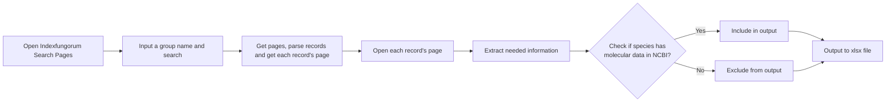

# **indexfungorum_spider** 

**A simple python spider written for extracting information from Index Fungorum automatically**

[Index Fungorum](https://indexfungorum.org/Names/Names.asp) is a dynamic webpage, making it impossible to directly scrape certain information using Python.

[Selenium](https://www.selenium.dev/zh-cn/documentation/) provides an interactive way for humans to interface with Index Fungorum through user input.



## Load Python packages and define functions

### Packages


```python
import re
import os
import sys
import time
import pandas as pd
import requests

from selenium import webdriver
from selenium.webdriver.edge.service import Service
from selenium.webdriver.common.by import By
from Bio import Entrez
from selenium.webdriver.support.ui import WebDriverWait
from selenium.webdriver.support import expected_conditions as EC

from tqdm import tqdm # Providing progress bar,to monitor the program’s progress if the group contains thousands of records.
```

### Functions

#### Parse result page for genus search


```python
def parse_search_page(html_doc):
    RED = '\033[31m'
    GREEN = '\033[32m'
    YELLOW = '\033[33m'
    RESET = '\033[0m'  # Reset color to default
    
    # Regex pattern to extract content between 'BofP</a>' and '<br><p><b>Pages:'
    pattern = r'BofP</a>(.*?)<br><p><b>Pages:'
    matches = re.findall(pattern, html_doc, re.DOTALL)
    
    if len(matches) == 1:
        record_lst = matches[0].split("<br>")
    else:
        sys.exit(f"Failed to extract the expected content. Check function: parse_search_page")

    # List to hold parsed record information
    records = []

    # Iterate through the extracted record lines
    for line in record_lst:
        # Regex pattern to extract record name and link
        try:
            record_name_link_pattern = r'href="(NamesRecord.asp\?RecordID=\d+)">([^<]+)'  # Match the record name and link
            match0 = re.search(record_name_link_pattern, line, re.DOTALL)
            record_name = match0.group(2)  # Get the record name
            record_link = "https://indexfungorum.org/Names/" + match0.group(1)  # Construct the full URL
        except:
            print(f"{RED}[Warning]{RESET} | {GREEN}{line}{RESET}")
            record_name = "NA"
            record_link = "NA"

        # Regex pattern to extract author and year
        try:
            author_year_pattern = r'</a>(.*?) (\d{4})'  # Match author and year after closing </a>
            match1 = re.search(author_year_pattern, line, re.DOTALL)
            record_author = match1.group(1).replace("&amp;","&").strip()  # Get the author
            year = match1.group(2)  # Get the year
            #print(record_author,"|",year)
        except:
            print(f"{RED}[Warning]{RESET} | {GREEN}{line}{RESET}")
            record_author = "NA"
            year = "NA"

        # Regex pattern to extract current name and link
        try:
            current_name_link_pattern = r'(http://www.speciesfungorum.org/Names/SynSpecies.asp\?RecordID=\d+)">([^<]+)'  # Match current name and link
            match2 = re.search(current_name_link_pattern, line)
            current_name = match2.group(2)  # Get the current name
            current_name_link = match2.group(1)  # Get the current name link
            #print(current_name,"|",current_name_link)
        except:
            print(f"{RED}[Warning]{RESET} | {GREEN}{line}{RESET}")
            current_name = "NA"
            current_name_link = "NA"

        # Append the record information as a list
        records.append([record_name, record_author, year, record_link, current_name, current_name_link])

    return records
```

#### Search by genus name


```python
def search(group_name):
    '''Input a record name and search for it.'''
    
    # Locate and clear the search box, then enter the search term
    search_box = driver.find_element(By.NAME, 'SearchTerm')
    search_box.clear()
    search_box.send_keys(group_name)  # Use the correct variable (group_name)
    
    # Click the search button to initiate the search
    search_btn = driver.find_element(By.CSS_SELECTOR, '[type="submit"]')
    search_btn.click()
    
    # Wait for the page to load
    # time.sleep(5)

    try:
        # Extract the number of records displayed on the page
        number_of_records = driver.find_element(By.XPATH, '/html/body/table/tbody/tr[2]/td/table/tbody/tr/td/p[1]/b[3]').text.split()[1]
        number_of_records = int(number_of_records)
    except Exception as e:
        print(f"Error: Failed to retrieve the number of records. {e}")
        return []

    # Calculate the number of pages required to display all records
    num_page = (number_of_records + 199) // 200  # This simplifies the page calculation logic
    
    # Output the number of pages and records for debugging
    print(f'Number of pages   : {num_page}', file=sys.stdout, flush=True)
    print(f'Number of records : {number_of_records}', file=sys.stdout, flush=True)
    
    #time.sleep(2)

    # Initialize a list to store all records
    all_records_lst = []

    # Parse the first page
    html = driver.page_source
    records_lst = parse_search_page(html)
    all_records_lst.extend(records_lst)
    
    # Parse additional pages, if any
    if num_page >= 2:
        for i in range(2, num_page + 1):
            try:
                # Locate and click the pagination button for the next page
                css_pattern = f'[href="Names.asp?pg={i}"]'
                page_btn = driver.find_element(By.CSS_SELECTOR, css_pattern)
                page_btn.click()

                # Wait for the next page to load
                #time.sleep(5)

                # Parse the page source for records
                html = driver.page_source
                records_lst = parse_search_page(html)
                all_records_lst.extend(records_lst)
            except:
                sys.exit(1)

    # Check if the number of records matches the expected count
    if len(all_records_lst) != number_of_records:
        print('Warning: Some records did not contain links.')
    
    # Return the list of all records
    return all_records_lst
```

#### Search by species name


```python
def search_species(search_species):  # Fixed typo in parameter name (seach_species -> search_species)
    '''Input a record name and search for it.'''
    
    try:
        # Wait for and locate the search box
        search_box = WebDriverWait(driver, 10).until(
            EC.presence_of_element_located((By.NAME, 'SearchTerm'))
        )
        search_box.clear()
        search_box.send_keys(search_species)  # Using correct variable name now
        
        # Find and click the search button
        search_btn = WebDriverWait(driver, 10).until(
            EC.element_to_be_clickable((By.CSS_SELECTOR, '[type="submit"]'))
        )
        search_btn.click()
        
        # Wait for results to load - better than static time.sleep()
        WebDriverWait(driver, 10).until(
            EC.presence_of_element_located((By.CLASS_NAME, "LinkColour1"))
        )
        
        links = driver.find_elements(By.CLASS_NAME, "LinkColour1")
        
        for link in links:
            href = link.get_attribute("href")
            species_name = link.text.strip()
            
            if not species_name:
                continue
                
            print(f"Found link: {href} - Species: {species_name}")
            
            if search_species.lower() == species_name.lower():  # Case-insensitive comparison
                print(f"Exact match found: {href}")
                return href  # Return the matching URL
        
        print(f"No exact match found for '{search_species}'")
        return None
        
    except Exception as e:
        print(f"Error during search: {str(e)}")
        return None
```


```python
def check_nucleotide_records(df):
    Entrez.email = "chenyanpeng1992@outlook.com"
    unique_term_nucleotide_count_dict = {}
    current_name_lst = list(set(df["Current_name"]))
    
    for search_nucleotide_term in tqdm(current_name_lst,desc="query NCBI nucleotide"):
        search_nucleotide_term = " ".join(search_nucleotide_term.split()[0:2])
        if search_nucleotide_term not in unique_term_nucleotide_count_dict:
            handle = Entrez.esearch(db="nucleotide", term=search_nucleotide_term)
            records = Entrez.read(handle)
            unique_term_nucleotide_count_dict[search_nucleotide_term] = records['Count']
    df['Nt_count'] = df['Current_name'].map(unique_term_nucleotide_count_dict)
    return df
```


```python
def output(search_term, df):
    # Export the DataFrame to Excel
    time_suffix = time.strftime('%Y%m%d')
    output_file = search_term + '_indexfungorum_records_' + str(time_suffix) + '.xlsx'
    df.to_excel(output_file, index=False)
```

####  Launch Indexfungorum search page


```python
def start_search_page():
    s = Service(r'msedgedriver.exe')
    option = webdriver.EdgeOptions()
    
    #option.add_argument('--headless')  # hide search window
    #driver = webdriver.Edge(service=s, options = option)
    driver = webdriver.Edge(service=s)
    
    #driver.implicitly_wait(5) # active Edge searching engine and 5s for the browser to load the dat
    driver.get('http://www.indexfungorum.org/')
    
    search_index_fungorum_element = driver.find_element(By.CSS_SELECTOR, '[href="./Names/Names.asp"]')
    search_index_fungorum_element.click()
    search_box = driver.find_element(By.NAME, 'SearchTerm')
    search_box.clear()
```

## Use

### Species records by genus name


```python
search_term = 'Diaporthe'
records_lst = search(search_term)
driver.close()
```

### Indexfungorum ID

#### Single search


```python
search_species("Peroneutypa leucaenae")
```

    Found link: https://www.indexfungorum.org/Names/NamesRecord.asp?RecordID=558722 - Species: Peroneutypa leucaenae
    Exact match found: https://www.indexfungorum.org/Names/NamesRecord.asp?RecordID=558722
    


    'https://www.indexfungorum.org/Names/NamesRecord.asp?RecordID=558722'


#### Batch search


```python
df = pd.read_excel("D:\BaiduSyncdisk\PhD_Thesis\FD_paper\sordariomycetes_source_table_sequence_upload.xlsx", sheet_name="genbank")
```


```python
df.head()
```


<div>
<style scoped>
    .dataframe tbody tr th:only-of-type {
        vertical-align: middle;
    }

    .dataframe tbody tr th {
        vertical-align: top;
    }

    .dataframe thead th {
        text-align: right;
    }
</style>
<table border="1" class="dataframe">
  <thead>
    <tr style="text-align: right;">
      <th></th>
      <th>Sequence_ID</th>
      <th>HUEST</th>
      <th>UESTCC</th>
      <th>Organism</th>
      <th>ITS</th>
      <th>LSU</th>
      <th>SSU</th>
      <th>ACT</th>
      <th>HIS3</th>
      <th>CHS1</th>
      <th>CAL</th>
      <th>RPB1</th>
      <th>GAPDH</th>
      <th>RPB2</th>
      <th>TEF1</th>
    </tr>
  </thead>
  <tbody>
    <tr>
      <th>0</th>
      <td>CC.HLC65</td>
      <td>HUEST 24.0022</td>
      <td>UESTCC 24.0021</td>
      <td>Coniochaeta fibrosae</td>
      <td>PP407752</td>
      <td>PP407616</td>
      <td>NaN</td>
      <td>NaN</td>
      <td>NaN</td>
      <td>NaN</td>
      <td>NaN</td>
      <td>NaN</td>
      <td>NaN</td>
      <td>NaN</td>
      <td>NaN</td>
    </tr>
    <tr>
      <th>1</th>
      <td>CC.LTG23</td>
      <td>HUEST 24.0021</td>
      <td>UESTCC 24.0020</td>
      <td>Coniochaeta acaciae</td>
      <td>PP407753</td>
      <td>PP407617</td>
      <td>NaN</td>
      <td>NaN</td>
      <td>NaN</td>
      <td>NaN</td>
      <td>NaN</td>
      <td>NaN</td>
      <td>NaN</td>
      <td>NaN</td>
      <td>NaN</td>
    </tr>
    <tr>
      <th>2</th>
      <td>CC.CBG09</td>
      <td>HUEST 24.0020</td>
      <td>UESTCC 24.0019</td>
      <td>Coniella quercicola</td>
      <td>PP407754</td>
      <td>PP407618</td>
      <td>NaN</td>
      <td>NaN</td>
      <td>NaN</td>
      <td>NaN</td>
      <td>NaN</td>
      <td>NaN</td>
      <td>NaN</td>
      <td>NaN</td>
      <td>PP555286</td>
    </tr>
    <tr>
      <th>3</th>
      <td>CC.HLG74.1</td>
      <td>HUEST 24.0105</td>
      <td>UESTCC 24.0100</td>
      <td>Synnemasporella aculeans</td>
      <td>PP407755</td>
      <td>PP407619</td>
      <td>NaN</td>
      <td>NaN</td>
      <td>NaN</td>
      <td>NaN</td>
      <td>NaN</td>
      <td>NaN</td>
      <td>NaN</td>
      <td>NaN</td>
      <td>NaN</td>
    </tr>
    <tr>
      <th>4</th>
      <td>CC.HLG95.1</td>
      <td>HUEST 24.0106</td>
      <td>UESTCC 24.0101</td>
      <td>Synnemasporella sichuanensis</td>
      <td>PP407756</td>
      <td>PP407620</td>
      <td>NaN</td>
      <td>NaN</td>
      <td>NaN</td>
      <td>NaN</td>
      <td>NaN</td>
      <td>NaN</td>
      <td>NaN</td>
      <td>NaN</td>
      <td>NaN</td>
    </tr>
  </tbody>
</table>
</div>


```python
for search_term in df['Organism'].to_list():
    search_species(search_term)
```

    Found link: https://www.indexfungorum.org/Names/NamesRecord.asp?RecordID=839390 - Species: Coniochaeta fibrosae
    Exact match found: https://www.indexfungorum.org/Names/NamesRecord.asp?RecordID=839390
    Found link: https://www.indexfungorum.org/Names/NamesRecord.asp?RecordID=553912 - Species: Coniochaeta acaciae
    Exact match found: https://www.indexfungorum.org/Names/NamesRecord.asp?RecordID=553912
    Found link: https://www.indexfungorum.org/Names/NamesRecord.asp?RecordID=817831 - Species: Coniella quercicola
    No exact match found for 'Coniella quercicola '
    Found link: https://www.indexfungorum.org/Names/NamesRecord.asp?RecordID=823996 - Species: Synnemasporella aculeans
    Exact match found: https://www.indexfungorum.org/Names/NamesRecord.asp?RecordID=823996
    Error during search: Message: 
    Stacktrace:
    	GetHandleVerifier [0x005A0E73+39155]
    	Microsoft::Applications::Events::time_ticks_t::time_ticks_t [0x0043E386+772070]
    	Microsoft::Applications::Events::ILogConfiguration::operator* [0x001F48EE+5182]
    	Microsoft::Applications::Events::GUID_t::GUID_t [0x0022998A+105610]
    	Microsoft::Applications::Events::GUID_t::GUID_t [0x00229C7A+106362]
    	Microsoft::Applications::Events::GUID_t::GUID_t [0x00259B92+302738]
    	Microsoft::Applications::Events::GUID_t::GUID_t [0x00241EC4+205252]
    	Microsoft::Applications::Events::GUID_t::GUID_t [0x00223091+78737]
    	Microsoft::Applications::Events::GUID_t::GUID_t [0x00258530+297008]
    	Microsoft::Applications::Events::GUID_t::GUID_t [0x00241B86+204422]
    	Microsoft::Applications::Events::GUID_t::GUID_t [0x00222947+76871]
    	Microsoft::Applications::Events::GUID_t::GUID_t [0x00221CF5+73717]
    	Microsoft::Applications::Events::GUID_t::GUID_t [0x00222764+76388]
    	sqlite3_dbdata_init [0x006A65AC+589708]
    	Microsoft::Applications::Events::FromJSON [0x00770463+699091]
    	Microsoft::Applications::Events::FromJSON [0x0076FDD5+697413]
    	Microsoft::Applications::Events::FromJSON [0x00761F0C+640380]
    	Microsoft::Applications::Events::FromJSON [0x00770C0F+701055]
    	Microsoft::Applications::Events::time_ticks_t::time_ticks_t [0x00454C7D+864477]
    	Microsoft::Applications::Events::time_ticks_t::time_ticks_t [0x00447DB8+811544]
    	Microsoft::Applications::Events::time_ticks_t::time_ticks_t [0x00447FA4+812036]
    	Microsoft::Applications::Events::time_ticks_t::time_ticks_t [0x0042EB05+708453]
    	BaseThreadInitThunk [0x77105D49+25]
    	RtlInitializeExceptionChain [0x77C0CE3B+107]
    	RtlGetAppContainerNamedObjectPath [0x77C0CDC1+561]
    
    Error during search: Message: 
    Stacktrace:
    	GetHandleVerifier [0x005A0E73+39155]
    	Microsoft::Applications::Events::time_ticks_t::time_ticks_t [0x0043E386+772070]
    	Microsoft::Applications::Events::ILogConfiguration::operator* [0x001F48EE+5182]
    	Microsoft::Applications::Events::GUID_t::GUID_t [0x0022998A+105610]
    	Microsoft::Applications::Events::GUID_t::GUID_t [0x00229C7A+106362]
    	Microsoft::Applications::Events::GUID_t::GUID_t [0x00259B92+302738]
    	Microsoft::Applications::Events::GUID_t::GUID_t [0x00241EC4+205252]
    	Microsoft::Applications::Events::GUID_t::GUID_t [0x00223091+78737]
    	Microsoft::Applications::Events::GUID_t::GUID_t [0x00258530+297008]
    	Microsoft::Applications::Events::GUID_t::GUID_t [0x00241B86+204422]
    	Microsoft::Applications::Events::GUID_t::GUID_t [0x00222947+76871]
    	Microsoft::Applications::Events::GUID_t::GUID_t [0x00221CF5+73717]
    	Microsoft::Applications::Events::GUID_t::GUID_t [0x00222764+76388]
    	sqlite3_dbdata_init [0x006A65AC+589708]
    	Microsoft::Applications::Events::FromJSON [0x00770463+699091]
    	Microsoft::Applications::Events::FromJSON [0x0076FDD5+697413]
    	Microsoft::Applications::Events::FromJSON [0x00761F0C+640380]
    	Microsoft::Applications::Events::FromJSON [0x00770C0F+701055]
    	Microsoft::Applications::Events::time_ticks_t::time_ticks_t [0x00454C7D+864477]
    	Microsoft::Applications::Events::time_ticks_t::time_ticks_t [0x00447DB8+811544]
    	Microsoft::Applications::Events::time_ticks_t::time_ticks_t [0x00447FA4+812036]
    	Microsoft::Applications::Events::time_ticks_t::time_ticks_t [0x0042EB05+708453]
    	BaseThreadInitThunk [0x77105D49+25]
    	RtlInitializeExceptionChain [0x77C0CE3B+107]
    	RtlGetAppContainerNamedObjectPath [0x77C0CDC1+561]
    
    Found link: https://www.indexfungorum.org/Names/NamesRecord.asp?RecordID=179190 - Species: Cytospora chrysosperma
    Exact match found: https://www.indexfungorum.org/Names/NamesRecord.asp?RecordID=179190
    Found link: https://www.indexfungorum.org/Names/NamesRecord.asp?RecordID=554083 - Species: Cytospora predappioensis
    Exact match found: https://www.indexfungorum.org/Names/NamesRecord.asp?RecordID=554083
    Found link: https://www.indexfungorum.org/Names/NamesRecord.asp?RecordID=854904 - Species: Distoseptispora chengduensis
    Exact match found: https://www.indexfungorum.org/Names/NamesRecord.asp?RecordID=854904
    Found link: https://www.indexfungorum.org/Names/NamesRecord.asp?RecordID=821273 - Species: Distoseptispora suoluoensis
    Exact match found: https://www.indexfungorum.org/Names/NamesRecord.asp?RecordID=821273
    Found link: https://www.indexfungorum.org/Names/NamesRecord.asp?RecordID=552223 - Species: Distoseptispora tectonae
    Exact match found: https://www.indexfungorum.org/Names/NamesRecord.asp?RecordID=552223
    Found link: https://www.indexfungorum.org/Names/NamesRecord.asp?RecordID=850205 - Species: Distoseptispora sichuanensis
    Exact match found: https://www.indexfungorum.org/Names/NamesRecord.asp?RecordID=850205
    Found link: https://www.indexfungorum.org/Names/NamesRecord.asp?RecordID=850205 - Species: Distoseptispora sichuanensis
    Exact match found: https://www.indexfungorum.org/Names/NamesRecord.asp?RecordID=850205
    Found link: https://www.indexfungorum.org/Names/NamesRecord.asp?RecordID=850205 - Species: Distoseptispora sichuanensis
    Exact match found: https://www.indexfungorum.org/Names/NamesRecord.asp?RecordID=850205
    Found link: https://www.indexfungorum.org/Names/NamesRecord.asp?RecordID=557452 - Species: Distoseptispora bambusae
    Exact match found: https://www.indexfungorum.org/Names/NamesRecord.asp?RecordID=557452
    Found link: https://www.indexfungorum.org/Names/NamesRecord.asp?RecordID=552223 - Species: Distoseptispora tectonae
    Exact match found: https://www.indexfungorum.org/Names/NamesRecord.asp?RecordID=552223
    Found link: https://www.indexfungorum.org/Names/NamesRecord.asp?RecordID=551834 - Species: Distoseptispora aquatica
    Exact match found: https://www.indexfungorum.org/Names/NamesRecord.asp?RecordID=551834
    Error during search: Message: 
    Stacktrace:
    	GetHandleVerifier [0x005A0E73+39155]
    	Microsoft::Applications::Events::time_ticks_t::time_ticks_t [0x0043E386+772070]
    	Microsoft::Applications::Events::ILogConfiguration::operator* [0x001F48EE+5182]
    	Microsoft::Applications::Events::GUID_t::GUID_t [0x0022998A+105610]
    	Microsoft::Applications::Events::GUID_t::GUID_t [0x00229C7A+106362]
    	Microsoft::Applications::Events::GUID_t::GUID_t [0x00259B92+302738]
    	Microsoft::Applications::Events::GUID_t::GUID_t [0x00241EC4+205252]
    	Microsoft::Applications::Events::GUID_t::GUID_t [0x00223091+78737]
    	Microsoft::Applications::Events::GUID_t::GUID_t [0x00258530+297008]
    	Microsoft::Applications::Events::GUID_t::GUID_t [0x00241B86+204422]
    	Microsoft::Applications::Events::GUID_t::GUID_t [0x00222947+76871]
    	Microsoft::Applications::Events::GUID_t::GUID_t [0x00221CF5+73717]
    	Microsoft::Applications::Events::GUID_t::GUID_t [0x00222764+76388]
    	sqlite3_dbdata_init [0x006A65AC+589708]
    	Microsoft::Applications::Events::FromJSON [0x00770463+699091]
    	Microsoft::Applications::Events::FromJSON [0x0076FDD5+697413]
    	Microsoft::Applications::Events::FromJSON [0x00761F0C+640380]
    	Microsoft::Applications::Events::FromJSON [0x00770C0F+701055]
    	Microsoft::Applications::Events::time_ticks_t::time_ticks_t [0x00454C7D+864477]
    	Microsoft::Applications::Events::time_ticks_t::time_ticks_t [0x00447DB8+811544]
    	Microsoft::Applications::Events::time_ticks_t::time_ticks_t [0x00447FA4+812036]
    	Microsoft::Applications::Events::time_ticks_t::time_ticks_t [0x0042EB05+708453]
    	BaseThreadInitThunk [0x77105D49+25]
    	RtlInitializeExceptionChain [0x77C0CE3B+107]
    	RtlGetAppContainerNamedObjectPath [0x77C0CDC1+561]
    
    Error during search: Message: 
    Stacktrace:
    	GetHandleVerifier [0x005A0E73+39155]
    	Microsoft::Applications::Events::time_ticks_t::time_ticks_t [0x0043E386+772070]
    	Microsoft::Applications::Events::ILogConfiguration::operator* [0x001F48EE+5182]
    	Microsoft::Applications::Events::GUID_t::GUID_t [0x0022998A+105610]
    	Microsoft::Applications::Events::GUID_t::GUID_t [0x00229C7A+106362]
    	Microsoft::Applications::Events::GUID_t::GUID_t [0x00259B92+302738]
    	Microsoft::Applications::Events::GUID_t::GUID_t [0x00241EC4+205252]
    	Microsoft::Applications::Events::GUID_t::GUID_t [0x00223091+78737]
    	Microsoft::Applications::Events::GUID_t::GUID_t [0x00258530+297008]
    	Microsoft::Applications::Events::GUID_t::GUID_t [0x00241B86+204422]
    	Microsoft::Applications::Events::GUID_t::GUID_t [0x00222947+76871]
    	Microsoft::Applications::Events::GUID_t::GUID_t [0x00221CF5+73717]
    	Microsoft::Applications::Events::GUID_t::GUID_t [0x00222764+76388]
    	sqlite3_dbdata_init [0x006A65AC+589708]
    	Microsoft::Applications::Events::FromJSON [0x00770463+699091]
    	Microsoft::Applications::Events::FromJSON [0x0076FDD5+697413]
    	Microsoft::Applications::Events::FromJSON [0x00761F0C+640380]
    	Microsoft::Applications::Events::FromJSON [0x00770C0F+701055]
    	Microsoft::Applications::Events::time_ticks_t::time_ticks_t [0x00454C7D+864477]
    	Microsoft::Applications::Events::time_ticks_t::time_ticks_t [0x00447DB8+811544]
    	Microsoft::Applications::Events::time_ticks_t::time_ticks_t [0x00447FA4+812036]
    	Microsoft::Applications::Events::time_ticks_t::time_ticks_t [0x0042EB05+708453]
    	BaseThreadInitThunk [0x77105D49+25]
    	RtlInitializeExceptionChain [0x77C0CE3B+107]
    	RtlGetAppContainerNamedObjectPath [0x77C0CDC1+561]
    
    Error during search: Message: 
    Stacktrace:
    	GetHandleVerifier [0x005A0E73+39155]
    	Microsoft::Applications::Events::time_ticks_t::time_ticks_t [0x0043E386+772070]
    	Microsoft::Applications::Events::ILogConfiguration::operator* [0x001F48EE+5182]
    	Microsoft::Applications::Events::GUID_t::GUID_t [0x0022998A+105610]
    	Microsoft::Applications::Events::GUID_t::GUID_t [0x00229C7A+106362]
    	Microsoft::Applications::Events::GUID_t::GUID_t [0x00259B92+302738]
    	Microsoft::Applications::Events::GUID_t::GUID_t [0x00241EC4+205252]
    	Microsoft::Applications::Events::GUID_t::GUID_t [0x00223091+78737]
    	Microsoft::Applications::Events::GUID_t::GUID_t [0x00258530+297008]
    	Microsoft::Applications::Events::GUID_t::GUID_t [0x00241B86+204422]
    	Microsoft::Applications::Events::GUID_t::GUID_t [0x00222947+76871]
    	Microsoft::Applications::Events::GUID_t::GUID_t [0x00221CF5+73717]
    	Microsoft::Applications::Events::GUID_t::GUID_t [0x00222764+76388]
    	sqlite3_dbdata_init [0x006A65AC+589708]
    	Microsoft::Applications::Events::FromJSON [0x00770463+699091]
    	Microsoft::Applications::Events::FromJSON [0x0076FDD5+697413]
    	Microsoft::Applications::Events::FromJSON [0x00761F0C+640380]
    	Microsoft::Applications::Events::FromJSON [0x00770C0F+701055]
    	Microsoft::Applications::Events::time_ticks_t::time_ticks_t [0x00454C7D+864477]
    	Microsoft::Applications::Events::time_ticks_t::time_ticks_t [0x00447DB8+811544]
    	Microsoft::Applications::Events::time_ticks_t::time_ticks_t [0x00447FA4+812036]
    	Microsoft::Applications::Events::time_ticks_t::time_ticks_t [0x0042EB05+708453]
    	BaseThreadInitThunk [0x77105D49+25]
    	RtlInitializeExceptionChain [0x77C0CE3B+107]
    	RtlGetAppContainerNamedObjectPath [0x77C0CDC1+561]
    
    Error during search: Message: 
    Stacktrace:
    	GetHandleVerifier [0x005A0E73+39155]
    	Microsoft::Applications::Events::time_ticks_t::time_ticks_t [0x0043E386+772070]
    	Microsoft::Applications::Events::ILogConfiguration::operator* [0x001F48EE+5182]
    	Microsoft::Applications::Events::GUID_t::GUID_t [0x0022998A+105610]
    	Microsoft::Applications::Events::GUID_t::GUID_t [0x00229C7A+106362]
    	Microsoft::Applications::Events::GUID_t::GUID_t [0x00259B92+302738]
    	Microsoft::Applications::Events::GUID_t::GUID_t [0x00241EC4+205252]
    	Microsoft::Applications::Events::GUID_t::GUID_t [0x00223091+78737]
    	Microsoft::Applications::Events::GUID_t::GUID_t [0x00258530+297008]
    	Microsoft::Applications::Events::GUID_t::GUID_t [0x00241B86+204422]
    	Microsoft::Applications::Events::GUID_t::GUID_t [0x00222947+76871]
    	Microsoft::Applications::Events::GUID_t::GUID_t [0x00221CF5+73717]
    	Microsoft::Applications::Events::GUID_t::GUID_t [0x00222764+76388]
    	sqlite3_dbdata_init [0x006A65AC+589708]
    	Microsoft::Applications::Events::FromJSON [0x00770463+699091]
    	Microsoft::Applications::Events::FromJSON [0x0076FDD5+697413]
    	Microsoft::Applications::Events::FromJSON [0x00761F0C+640380]
    	Microsoft::Applications::Events::FromJSON [0x00770C0F+701055]
    	Microsoft::Applications::Events::time_ticks_t::time_ticks_t [0x00454C7D+864477]
    	Microsoft::Applications::Events::time_ticks_t::time_ticks_t [0x00447DB8+811544]
    	Microsoft::Applications::Events::time_ticks_t::time_ticks_t [0x00447FA4+812036]
    	Microsoft::Applications::Events::time_ticks_t::time_ticks_t [0x0042EB05+708453]
    	BaseThreadInitThunk [0x77105D49+25]
    	RtlInitializeExceptionChain [0x77C0CE3B+107]
    	RtlGetAppContainerNamedObjectPath [0x77C0CDC1+561]
    
    Found link: https://www.indexfungorum.org/Names/NamesRecord.asp?RecordID=810578 - Species: Diaporthe biconispora
    Exact match found: https://www.indexfungorum.org/Names/NamesRecord.asp?RecordID=810578
    Error during search: Message: 
    Stacktrace:
    	GetHandleVerifier [0x005A0E73+39155]
    	Microsoft::Applications::Events::time_ticks_t::time_ticks_t [0x0043E386+772070]
    	Microsoft::Applications::Events::ILogConfiguration::operator* [0x001F48EE+5182]
    	Microsoft::Applications::Events::GUID_t::GUID_t [0x0022998A+105610]
    	Microsoft::Applications::Events::GUID_t::GUID_t [0x00229C7A+106362]
    	Microsoft::Applications::Events::GUID_t::GUID_t [0x00259B92+302738]
    	Microsoft::Applications::Events::GUID_t::GUID_t [0x00241EC4+205252]
    	Microsoft::Applications::Events::GUID_t::GUID_t [0x00223091+78737]
    	Microsoft::Applications::Events::GUID_t::GUID_t [0x00258530+297008]
    	Microsoft::Applications::Events::GUID_t::GUID_t [0x00241B86+204422]
    	Microsoft::Applications::Events::GUID_t::GUID_t [0x00222947+76871]
    	Microsoft::Applications::Events::GUID_t::GUID_t [0x00221CF5+73717]
    	Microsoft::Applications::Events::GUID_t::GUID_t [0x00222764+76388]
    	sqlite3_dbdata_init [0x006A65AC+589708]
    	Microsoft::Applications::Events::FromJSON [0x00770463+699091]
    	Microsoft::Applications::Events::FromJSON [0x0076FDD5+697413]
    	Microsoft::Applications::Events::FromJSON [0x00761F0C+640380]
    	Microsoft::Applications::Events::FromJSON [0x00770C0F+701055]
    	Microsoft::Applications::Events::time_ticks_t::time_ticks_t [0x00454C7D+864477]
    	Microsoft::Applications::Events::time_ticks_t::time_ticks_t [0x00447DB8+811544]
    	Microsoft::Applications::Events::time_ticks_t::time_ticks_t [0x00447FA4+812036]
    	Microsoft::Applications::Events::time_ticks_t::time_ticks_t [0x0042EB05+708453]
    	BaseThreadInitThunk [0x77105D49+25]
    	RtlInitializeExceptionChain [0x77C0CE3B+107]
    	RtlGetAppContainerNamedObjectPath [0x77C0CDC1+561]
    
    Found link: https://www.indexfungorum.org/Names/NamesRecord.asp?RecordID=553773 - Species: Diaporthe fukushii
    Exact match found: https://www.indexfungorum.org/Names/NamesRecord.asp?RecordID=553773
    Error during search: Message: 
    Stacktrace:
    	GetHandleVerifier [0x005A0E73+39155]
    	Microsoft::Applications::Events::time_ticks_t::time_ticks_t [0x0043E386+772070]
    	Microsoft::Applications::Events::ILogConfiguration::operator* [0x001F48EE+5182]
    	Microsoft::Applications::Events::GUID_t::GUID_t [0x0022998A+105610]
    	Microsoft::Applications::Events::GUID_t::GUID_t [0x00229C7A+106362]
    	Microsoft::Applications::Events::GUID_t::GUID_t [0x00259B92+302738]
    	Microsoft::Applications::Events::GUID_t::GUID_t [0x00241EC4+205252]
    	Microsoft::Applications::Events::GUID_t::GUID_t [0x00223091+78737]
    	Microsoft::Applications::Events::GUID_t::GUID_t [0x00258530+297008]
    	Microsoft::Applications::Events::GUID_t::GUID_t [0x00241B86+204422]
    	Microsoft::Applications::Events::GUID_t::GUID_t [0x00222947+76871]
    	Microsoft::Applications::Events::GUID_t::GUID_t [0x00221CF5+73717]
    	Microsoft::Applications::Events::GUID_t::GUID_t [0x00222764+76388]
    	sqlite3_dbdata_init [0x006A65AC+589708]
    	Microsoft::Applications::Events::FromJSON [0x00770463+699091]
    	Microsoft::Applications::Events::FromJSON [0x0076FDD5+697413]
    	Microsoft::Applications::Events::FromJSON [0x00761F0C+640380]
    	Microsoft::Applications::Events::FromJSON [0x00770C0F+701055]
    	Microsoft::Applications::Events::time_ticks_t::time_ticks_t [0x00454C7D+864477]
    	Microsoft::Applications::Events::time_ticks_t::time_ticks_t [0x00447DB8+811544]
    	Microsoft::Applications::Events::time_ticks_t::time_ticks_t [0x00447FA4+812036]
    	Microsoft::Applications::Events::time_ticks_t::time_ticks_t [0x0042EB05+708453]
    	BaseThreadInitThunk [0x77105D49+25]
    	RtlInitializeExceptionChain [0x77C0CE3B+107]
    	RtlGetAppContainerNamedObjectPath [0x77C0CDC1+561]
    
    Error during search: Message: 
    Stacktrace:
    	GetHandleVerifier [0x005A0E73+39155]
    	Microsoft::Applications::Events::time_ticks_t::time_ticks_t [0x0043E386+772070]
    	Microsoft::Applications::Events::ILogConfiguration::operator* [0x001F48EE+5182]
    	Microsoft::Applications::Events::GUID_t::GUID_t [0x0022998A+105610]
    	Microsoft::Applications::Events::GUID_t::GUID_t [0x00229C7A+106362]
    	Microsoft::Applications::Events::GUID_t::GUID_t [0x00259B92+302738]
    	Microsoft::Applications::Events::GUID_t::GUID_t [0x00241EC4+205252]
    	Microsoft::Applications::Events::GUID_t::GUID_t [0x00223091+78737]
    	Microsoft::Applications::Events::GUID_t::GUID_t [0x00258530+297008]
    	Microsoft::Applications::Events::GUID_t::GUID_t [0x00241B86+204422]
    	Microsoft::Applications::Events::GUID_t::GUID_t [0x00222947+76871]
    	Microsoft::Applications::Events::GUID_t::GUID_t [0x00221CF5+73717]
    	Microsoft::Applications::Events::GUID_t::GUID_t [0x00222764+76388]
    	sqlite3_dbdata_init [0x006A65AC+589708]
    	Microsoft::Applications::Events::FromJSON [0x00770463+699091]
    	Microsoft::Applications::Events::FromJSON [0x0076FDD5+697413]
    	Microsoft::Applications::Events::FromJSON [0x00761F0C+640380]
    	Microsoft::Applications::Events::FromJSON [0x00770C0F+701055]
    	Microsoft::Applications::Events::time_ticks_t::time_ticks_t [0x00454C7D+864477]
    	Microsoft::Applications::Events::time_ticks_t::time_ticks_t [0x00447DB8+811544]
    	Microsoft::Applications::Events::time_ticks_t::time_ticks_t [0x00447FA4+812036]
    	Microsoft::Applications::Events::time_ticks_t::time_ticks_t [0x0042EB05+708453]
    	BaseThreadInitThunk [0x77105D49+25]
    	RtlInitializeExceptionChain [0x77C0CE3B+107]
    	RtlGetAppContainerNamedObjectPath [0x77C0CDC1+561]
    
    Error during search: Message: 
    Stacktrace:
    	GetHandleVerifier [0x005A0E73+39155]
    	Microsoft::Applications::Events::time_ticks_t::time_ticks_t [0x0043E386+772070]
    	Microsoft::Applications::Events::ILogConfiguration::operator* [0x001F48EE+5182]
    	Microsoft::Applications::Events::GUID_t::GUID_t [0x0022998A+105610]
    	Microsoft::Applications::Events::GUID_t::GUID_t [0x00229C7A+106362]
    	Microsoft::Applications::Events::GUID_t::GUID_t [0x00259B92+302738]
    	Microsoft::Applications::Events::GUID_t::GUID_t [0x00241EC4+205252]
    	Microsoft::Applications::Events::GUID_t::GUID_t [0x00223091+78737]
    	Microsoft::Applications::Events::GUID_t::GUID_t [0x00258530+297008]
    	Microsoft::Applications::Events::GUID_t::GUID_t [0x00241B86+204422]
    	Microsoft::Applications::Events::GUID_t::GUID_t [0x00222947+76871]
    	Microsoft::Applications::Events::GUID_t::GUID_t [0x00221CF5+73717]
    	Microsoft::Applications::Events::GUID_t::GUID_t [0x00222764+76388]
    	sqlite3_dbdata_init [0x006A65AC+589708]
    	Microsoft::Applications::Events::FromJSON [0x00770463+699091]
    	Microsoft::Applications::Events::FromJSON [0x0076FDD5+697413]
    	Microsoft::Applications::Events::FromJSON [0x00761F0C+640380]
    	Microsoft::Applications::Events::FromJSON [0x00770C0F+701055]
    	Microsoft::Applications::Events::time_ticks_t::time_ticks_t [0x00454C7D+864477]
    	Microsoft::Applications::Events::time_ticks_t::time_ticks_t [0x00447DB8+811544]
    	Microsoft::Applications::Events::time_ticks_t::time_ticks_t [0x00447FA4+812036]
    	Microsoft::Applications::Events::time_ticks_t::time_ticks_t [0x0042EB05+708453]
    	BaseThreadInitThunk [0x77105D49+25]
    	RtlInitializeExceptionChain [0x77C0CE3B+107]
    	RtlGetAppContainerNamedObjectPath [0x77C0CDC1+561]
    
    Found link: https://www.indexfungorum.org/Names/NamesRecord.asp?RecordID=552939 - Species: Diaporthe juglandicola
    Exact match found: https://www.indexfungorum.org/Names/NamesRecord.asp?RecordID=552939
    Error during search: Message: 
    Stacktrace:
    	GetHandleVerifier [0x005A0E73+39155]
    	Microsoft::Applications::Events::time_ticks_t::time_ticks_t [0x0043E386+772070]
    	Microsoft::Applications::Events::ILogConfiguration::operator* [0x001F48EE+5182]
    	Microsoft::Applications::Events::GUID_t::GUID_t [0x0022998A+105610]
    	Microsoft::Applications::Events::GUID_t::GUID_t [0x00229C7A+106362]
    	Microsoft::Applications::Events::GUID_t::GUID_t [0x00259B92+302738]
    	Microsoft::Applications::Events::GUID_t::GUID_t [0x00241EC4+205252]
    	Microsoft::Applications::Events::GUID_t::GUID_t [0x00223091+78737]
    	Microsoft::Applications::Events::GUID_t::GUID_t [0x00258530+297008]
    	Microsoft::Applications::Events::GUID_t::GUID_t [0x00241B86+204422]
    	Microsoft::Applications::Events::GUID_t::GUID_t [0x00222947+76871]
    	Microsoft::Applications::Events::GUID_t::GUID_t [0x00221CF5+73717]
    	Microsoft::Applications::Events::GUID_t::GUID_t [0x00222764+76388]
    	sqlite3_dbdata_init [0x006A65AC+589708]
    	Microsoft::Applications::Events::FromJSON [0x00770463+699091]
    	Microsoft::Applications::Events::FromJSON [0x0076FDD5+697413]
    	Microsoft::Applications::Events::FromJSON [0x00761F0C+640380]
    	Microsoft::Applications::Events::FromJSON [0x00770C0F+701055]
    	Microsoft::Applications::Events::time_ticks_t::time_ticks_t [0x00454C7D+864477]
    	Microsoft::Applications::Events::time_ticks_t::time_ticks_t [0x00447DB8+811544]
    	Microsoft::Applications::Events::time_ticks_t::time_ticks_t [0x00447FA4+812036]
    	Microsoft::Applications::Events::time_ticks_t::time_ticks_t [0x0042EB05+708453]
    	BaseThreadInitThunk [0x77105D49+25]
    	RtlInitializeExceptionChain [0x77C0CE3B+107]
    	RtlGetAppContainerNamedObjectPath [0x77C0CDC1+561]
    
    Error during search: Message: 
    Stacktrace:
    	GetHandleVerifier [0x005A0E73+39155]
    	Microsoft::Applications::Events::time_ticks_t::time_ticks_t [0x0043E386+772070]
    	Microsoft::Applications::Events::ILogConfiguration::operator* [0x001F48EE+5182]
    	Microsoft::Applications::Events::GUID_t::GUID_t [0x0022998A+105610]
    	Microsoft::Applications::Events::GUID_t::GUID_t [0x00229C7A+106362]
    	Microsoft::Applications::Events::GUID_t::GUID_t [0x00259B92+302738]
    	Microsoft::Applications::Events::GUID_t::GUID_t [0x00241EC4+205252]
    	Microsoft::Applications::Events::GUID_t::GUID_t [0x00223091+78737]
    	Microsoft::Applications::Events::GUID_t::GUID_t [0x00258530+297008]
    	Microsoft::Applications::Events::GUID_t::GUID_t [0x00241B86+204422]
    	Microsoft::Applications::Events::GUID_t::GUID_t [0x00222947+76871]
    	Microsoft::Applications::Events::GUID_t::GUID_t [0x00221CF5+73717]
    	Microsoft::Applications::Events::GUID_t::GUID_t [0x00222764+76388]
    	sqlite3_dbdata_init [0x006A65AC+589708]
    	Microsoft::Applications::Events::FromJSON [0x00770463+699091]
    	Microsoft::Applications::Events::FromJSON [0x0076FDD5+697413]
    	Microsoft::Applications::Events::FromJSON [0x00761F0C+640380]
    	Microsoft::Applications::Events::FromJSON [0x00770C0F+701055]
    	Microsoft::Applications::Events::time_ticks_t::time_ticks_t [0x00454C7D+864477]
    	Microsoft::Applications::Events::time_ticks_t::time_ticks_t [0x00447DB8+811544]
    	Microsoft::Applications::Events::time_ticks_t::time_ticks_t [0x00447FA4+812036]
    	Microsoft::Applications::Events::time_ticks_t::time_ticks_t [0x0042EB05+708453]
    	BaseThreadInitThunk [0x77105D49+25]
    	RtlInitializeExceptionChain [0x77C0CE3B+107]
    	RtlGetAppContainerNamedObjectPath [0x77C0CDC1+561]
    
    Error during search: Message: 
    Stacktrace:
    	GetHandleVerifier [0x005A0E73+39155]
    	Microsoft::Applications::Events::time_ticks_t::time_ticks_t [0x0043E386+772070]
    	Microsoft::Applications::Events::ILogConfiguration::operator* [0x001F48EE+5182]
    	Microsoft::Applications::Events::GUID_t::GUID_t [0x0022998A+105610]
    	Microsoft::Applications::Events::GUID_t::GUID_t [0x00229C7A+106362]
    	Microsoft::Applications::Events::GUID_t::GUID_t [0x00259B92+302738]
    	Microsoft::Applications::Events::GUID_t::GUID_t [0x00241EC4+205252]
    	Microsoft::Applications::Events::GUID_t::GUID_t [0x00223091+78737]
    	Microsoft::Applications::Events::GUID_t::GUID_t [0x00258530+297008]
    	Microsoft::Applications::Events::GUID_t::GUID_t [0x00241B86+204422]
    	Microsoft::Applications::Events::GUID_t::GUID_t [0x00222947+76871]
    	Microsoft::Applications::Events::GUID_t::GUID_t [0x00221CF5+73717]
    	Microsoft::Applications::Events::GUID_t::GUID_t [0x00222764+76388]
    	sqlite3_dbdata_init [0x006A65AC+589708]
    	Microsoft::Applications::Events::FromJSON [0x00770463+699091]
    	Microsoft::Applications::Events::FromJSON [0x0076FDD5+697413]
    	Microsoft::Applications::Events::FromJSON [0x00761F0C+640380]
    	Microsoft::Applications::Events::FromJSON [0x00770C0F+701055]
    	Microsoft::Applications::Events::time_ticks_t::time_ticks_t [0x00454C7D+864477]
    	Microsoft::Applications::Events::time_ticks_t::time_ticks_t [0x00447DB8+811544]
    	Microsoft::Applications::Events::time_ticks_t::time_ticks_t [0x00447FA4+812036]
    	Microsoft::Applications::Events::time_ticks_t::time_ticks_t [0x0042EB05+708453]
    	BaseThreadInitThunk [0x77105D49+25]
    	RtlInitializeExceptionChain [0x77C0CE3B+107]
    	RtlGetAppContainerNamedObjectPath [0x77C0CDC1+561]
    
    Error during search: Message: 
    Stacktrace:
    	GetHandleVerifier [0x005A0E73+39155]
    	Microsoft::Applications::Events::time_ticks_t::time_ticks_t [0x0043E386+772070]
    	Microsoft::Applications::Events::ILogConfiguration::operator* [0x001F48EE+5182]
    	Microsoft::Applications::Events::GUID_t::GUID_t [0x0022998A+105610]
    	Microsoft::Applications::Events::GUID_t::GUID_t [0x00229C7A+106362]
    	Microsoft::Applications::Events::GUID_t::GUID_t [0x00259B92+302738]
    	Microsoft::Applications::Events::GUID_t::GUID_t [0x00241EC4+205252]
    	Microsoft::Applications::Events::GUID_t::GUID_t [0x00223091+78737]
    	Microsoft::Applications::Events::GUID_t::GUID_t [0x00258530+297008]
    	Microsoft::Applications::Events::GUID_t::GUID_t [0x00241B86+204422]
    	Microsoft::Applications::Events::GUID_t::GUID_t [0x00222947+76871]
    	Microsoft::Applications::Events::GUID_t::GUID_t [0x00221CF5+73717]
    	Microsoft::Applications::Events::GUID_t::GUID_t [0x00222764+76388]
    	sqlite3_dbdata_init [0x006A65AC+589708]
    	Microsoft::Applications::Events::FromJSON [0x00770463+699091]
    	Microsoft::Applications::Events::FromJSON [0x0076FDD5+697413]
    	Microsoft::Applications::Events::FromJSON [0x00761F0C+640380]
    	Microsoft::Applications::Events::FromJSON [0x00770C0F+701055]
    	Microsoft::Applications::Events::time_ticks_t::time_ticks_t [0x00454C7D+864477]
    	Microsoft::Applications::Events::time_ticks_t::time_ticks_t [0x00447DB8+811544]
    	Microsoft::Applications::Events::time_ticks_t::time_ticks_t [0x00447FA4+812036]
    	Microsoft::Applications::Events::time_ticks_t::time_ticks_t [0x0042EB05+708453]
    	BaseThreadInitThunk [0x77105D49+25]
    	RtlInitializeExceptionChain [0x77C0CE3B+107]
    	RtlGetAppContainerNamedObjectPath [0x77C0CDC1+561]
    
    Error during search: Message: 
    Stacktrace:
    	GetHandleVerifier [0x005A0E73+39155]
    	Microsoft::Applications::Events::time_ticks_t::time_ticks_t [0x0043E386+772070]
    	Microsoft::Applications::Events::ILogConfiguration::operator* [0x001F48EE+5182]
    	Microsoft::Applications::Events::GUID_t::GUID_t [0x0022998A+105610]
    	Microsoft::Applications::Events::GUID_t::GUID_t [0x00229C7A+106362]
    	Microsoft::Applications::Events::GUID_t::GUID_t [0x00259B92+302738]
    	Microsoft::Applications::Events::GUID_t::GUID_t [0x00241EC4+205252]
    	Microsoft::Applications::Events::GUID_t::GUID_t [0x00223091+78737]
    	Microsoft::Applications::Events::GUID_t::GUID_t [0x00258530+297008]
    	Microsoft::Applications::Events::GUID_t::GUID_t [0x00241B86+204422]
    	Microsoft::Applications::Events::GUID_t::GUID_t [0x00222947+76871]
    	Microsoft::Applications::Events::GUID_t::GUID_t [0x00221CF5+73717]
    	Microsoft::Applications::Events::GUID_t::GUID_t [0x00222764+76388]
    	sqlite3_dbdata_init [0x006A65AC+589708]
    	Microsoft::Applications::Events::FromJSON [0x00770463+699091]
    	Microsoft::Applications::Events::FromJSON [0x0076FDD5+697413]
    	Microsoft::Applications::Events::FromJSON [0x00761F0C+640380]
    	Microsoft::Applications::Events::FromJSON [0x00770C0F+701055]
    	Microsoft::Applications::Events::time_ticks_t::time_ticks_t [0x00454C7D+864477]
    	Microsoft::Applications::Events::time_ticks_t::time_ticks_t [0x00447DB8+811544]
    	Microsoft::Applications::Events::time_ticks_t::time_ticks_t [0x00447FA4+812036]
    	Microsoft::Applications::Events::time_ticks_t::time_ticks_t [0x0042EB05+708453]
    	BaseThreadInitThunk [0x77105D49+25]
    	RtlInitializeExceptionChain [0x77C0CE3B+107]
    	RtlGetAppContainerNamedObjectPath [0x77C0CDC1+561]
    
    Found link: https://www.indexfungorum.org/Names/NamesRecord.asp?RecordID=841949 - Species: Xylolentia matsushimae
    No exact match found for 'Xylolentia matsushimae '
    Error during search: Message: 
    Stacktrace:
    	GetHandleVerifier [0x005A0E73+39155]
    	Microsoft::Applications::Events::time_ticks_t::time_ticks_t [0x0043E386+772070]
    	Microsoft::Applications::Events::ILogConfiguration::operator* [0x001F48EE+5182]
    	Microsoft::Applications::Events::GUID_t::GUID_t [0x0022998A+105610]
    	Microsoft::Applications::Events::GUID_t::GUID_t [0x00229C7A+106362]
    	Microsoft::Applications::Events::GUID_t::GUID_t [0x00259B92+302738]
    	Microsoft::Applications::Events::GUID_t::GUID_t [0x00241EC4+205252]
    	Microsoft::Applications::Events::GUID_t::GUID_t [0x00223091+78737]
    	Microsoft::Applications::Events::GUID_t::GUID_t [0x00258530+297008]
    	Microsoft::Applications::Events::GUID_t::GUID_t [0x00241B86+204422]
    	Microsoft::Applications::Events::GUID_t::GUID_t [0x00222947+76871]
    	Microsoft::Applications::Events::GUID_t::GUID_t [0x00221CF5+73717]
    	Microsoft::Applications::Events::GUID_t::GUID_t [0x00222764+76388]
    	sqlite3_dbdata_init [0x006A65AC+589708]
    	Microsoft::Applications::Events::FromJSON [0x00770463+699091]
    	Microsoft::Applications::Events::FromJSON [0x0076FDD5+697413]
    	Microsoft::Applications::Events::FromJSON [0x00761F0C+640380]
    	Microsoft::Applications::Events::FromJSON [0x00770C0F+701055]
    	Microsoft::Applications::Events::time_ticks_t::time_ticks_t [0x00454C7D+864477]
    	Microsoft::Applications::Events::time_ticks_t::time_ticks_t [0x00447DB8+811544]
    	Microsoft::Applications::Events::time_ticks_t::time_ticks_t [0x00447FA4+812036]
    	Microsoft::Applications::Events::time_ticks_t::time_ticks_t [0x0042EB05+708453]
    	BaseThreadInitThunk [0x77105D49+25]
    	RtlInitializeExceptionChain [0x77C0CE3B+107]
    	RtlGetAppContainerNamedObjectPath [0x77C0CDC1+561]
    
    Found link: https://www.indexfungorum.org/Names/NamesRecord.asp?RecordID=841917 - Species: Thyridium flavostromatum
    Exact match found: https://www.indexfungorum.org/Names/NamesRecord.asp?RecordID=841917
    Found link: https://www.indexfungorum.org/Names/NamesRecord.asp?RecordID=357048 - Species: Phaeoacremonium scolyti
    No exact match found for 'Phaeoacremonium scolyti '
    Found link: https://www.indexfungorum.org/Names/NamesRecord.asp?RecordID=176099 - Species: Colletotrichum camelliae
    Exact match found: https://www.indexfungorum.org/Names/NamesRecord.asp?RecordID=176099
    Error during search: Message: 
    Stacktrace:
    	GetHandleVerifier [0x005A0E73+39155]
    	Microsoft::Applications::Events::time_ticks_t::time_ticks_t [0x0043E386+772070]
    	Microsoft::Applications::Events::ILogConfiguration::operator* [0x001F48EE+5182]
    	Microsoft::Applications::Events::GUID_t::GUID_t [0x0022998A+105610]
    	Microsoft::Applications::Events::GUID_t::GUID_t [0x00229C7A+106362]
    	Microsoft::Applications::Events::GUID_t::GUID_t [0x00259B92+302738]
    	Microsoft::Applications::Events::GUID_t::GUID_t [0x00241EC4+205252]
    	Microsoft::Applications::Events::GUID_t::GUID_t [0x00223091+78737]
    	Microsoft::Applications::Events::GUID_t::GUID_t [0x00258530+297008]
    	Microsoft::Applications::Events::GUID_t::GUID_t [0x00241B86+204422]
    	Microsoft::Applications::Events::GUID_t::GUID_t [0x00222947+76871]
    	Microsoft::Applications::Events::GUID_t::GUID_t [0x00221CF5+73717]
    	Microsoft::Applications::Events::GUID_t::GUID_t [0x00222764+76388]
    	sqlite3_dbdata_init [0x006A65AC+589708]
    	Microsoft::Applications::Events::FromJSON [0x00770463+699091]
    	Microsoft::Applications::Events::FromJSON [0x0076FDD5+697413]
    	Microsoft::Applications::Events::FromJSON [0x00761F0C+640380]
    	Microsoft::Applications::Events::FromJSON [0x00770C0F+701055]
    	Microsoft::Applications::Events::time_ticks_t::time_ticks_t [0x00454C7D+864477]
    	Microsoft::Applications::Events::time_ticks_t::time_ticks_t [0x00447DB8+811544]
    	Microsoft::Applications::Events::time_ticks_t::time_ticks_t [0x00447FA4+812036]
    	Microsoft::Applications::Events::time_ticks_t::time_ticks_t [0x0042EB05+708453]
    	BaseThreadInitThunk [0x77105D49+25]
    	RtlInitializeExceptionChain [0x77C0CE3B+107]
    	RtlGetAppContainerNamedObjectPath [0x77C0CDC1+561]
    
    Found link: https://www.indexfungorum.org/Names/NamesRecord.asp?RecordID=564159 - Species: Colletotrichum tropicicola
    Exact match found: https://www.indexfungorum.org/Names/NamesRecord.asp?RecordID=564159
    Found link: https://www.indexfungorum.org/Names/NamesRecord.asp?RecordID=515409 - Species: Colletotrichum fructicola
    No exact match found for 'Colletotrichum fructicola '
    Found link: https://www.indexfungorum.org/Names/NamesRecord.asp?RecordID=515410 - Species: Colletotrichum siamense
    Exact match found: https://www.indexfungorum.org/Names/NamesRecord.asp?RecordID=515410
    Found link: https://www.indexfungorum.org/Names/NamesRecord.asp?RecordID=515410 - Species: Colletotrichum siamense
    Exact match found: https://www.indexfungorum.org/Names/NamesRecord.asp?RecordID=515410
    Found link: https://www.indexfungorum.org/Names/NamesRecord.asp?RecordID=372362 - Species: Colletotrichum boninense
    No exact match found for 'Colletotrichum boninens'
    Found link: https://www.indexfungorum.org/Names/NamesRecord.asp?RecordID=372362 - Species: Colletotrichum boninense
    No exact match found for 'Colletotrichum boninens'
    Found link: https://www.indexfungorum.org/Names/NamesRecord.asp?RecordID=515410 - Species: Colletotrichum siamense
    Exact match found: https://www.indexfungorum.org/Names/NamesRecord.asp?RecordID=515410
    Found link: https://www.indexfungorum.org/Names/NamesRecord.asp?RecordID=372362 - Species: Colletotrichum boninense
    No exact match found for 'Colletotrichum boninens'
    Found link: https://www.indexfungorum.org/Names/NamesRecord.asp?RecordID=372362 - Species: Colletotrichum boninense
    No exact match found for 'Colletotrichum boninens'
    Found link: https://www.indexfungorum.org/Names/NamesRecord.asp?RecordID=372362 - Species: Colletotrichum boninense
    No exact match found for 'Colletotrichum boninens'
    Found link: https://www.indexfungorum.org/Names/NamesRecord.asp?RecordID=372362 - Species: Colletotrichum boninense
    No exact match found for 'Colletotrichum boninens'
    Found link: https://www.indexfungorum.org/Names/NamesRecord.asp?RecordID=280780 - Species: Colletotrichum truncatum
    Exact match found: https://www.indexfungorum.org/Names/NamesRecord.asp?RecordID=280780
    Found link: https://www.indexfungorum.org/Names/NamesRecord.asp?RecordID=295335 - Species: Colletotrichum godetiae
    Exact match found: https://www.indexfungorum.org/Names/NamesRecord.asp?RecordID=295335
    Found link: https://www.indexfungorum.org/Names/NamesRecord.asp?RecordID=519594 - Species: Sarocladium strictum
    Exact match found: https://www.indexfungorum.org/Names/NamesRecord.asp?RecordID=519594
    Error during search: Message: 
    Stacktrace:
    	GetHandleVerifier [0x005A0E73+39155]
    	Microsoft::Applications::Events::time_ticks_t::time_ticks_t [0x0043E386+772070]
    	Microsoft::Applications::Events::ILogConfiguration::operator* [0x001F48EE+5182]
    	Microsoft::Applications::Events::GUID_t::GUID_t [0x0022998A+105610]
    	Microsoft::Applications::Events::GUID_t::GUID_t [0x00229C7A+106362]
    	Microsoft::Applications::Events::GUID_t::GUID_t [0x00259B92+302738]
    	Microsoft::Applications::Events::GUID_t::GUID_t [0x00241EC4+205252]
    	Microsoft::Applications::Events::GUID_t::GUID_t [0x00223091+78737]
    	Microsoft::Applications::Events::GUID_t::GUID_t [0x00258530+297008]
    	Microsoft::Applications::Events::GUID_t::GUID_t [0x00241B86+204422]
    	Microsoft::Applications::Events::GUID_t::GUID_t [0x00222947+76871]
    	Microsoft::Applications::Events::GUID_t::GUID_t [0x00221CF5+73717]
    	Microsoft::Applications::Events::GUID_t::GUID_t [0x00222764+76388]
    	sqlite3_dbdata_init [0x006A65AC+589708]
    	Microsoft::Applications::Events::FromJSON [0x00770463+699091]
    	Microsoft::Applications::Events::FromJSON [0x0076FDD5+697413]
    	Microsoft::Applications::Events::FromJSON [0x00761F0C+640380]
    	Microsoft::Applications::Events::FromJSON [0x00770C0F+701055]
    	Microsoft::Applications::Events::time_ticks_t::time_ticks_t [0x00454C7D+864477]
    	Microsoft::Applications::Events::time_ticks_t::time_ticks_t [0x00447DB8+811544]
    	Microsoft::Applications::Events::time_ticks_t::time_ticks_t [0x00447FA4+812036]
    	Microsoft::Applications::Events::time_ticks_t::time_ticks_t [0x0042EB05+708453]
    	BaseThreadInitThunk [0x77105D49+25]
    	RtlInitializeExceptionChain [0x77C0CE3B+107]
    	RtlGetAppContainerNamedObjectPath [0x77C0CDC1+561]
    
    Found link: https://www.indexfungorum.org/Names/NamesRecord.asp?RecordID=228968 - Species: Clonostachys rosea
    Exact match found: https://www.indexfungorum.org/Names/NamesRecord.asp?RecordID=228968
    Found link: https://www.indexfungorum.org/Names/NamesRecord.asp?RecordID=485148 - Species: Clonostachys pityrodes
    Exact match found: https://www.indexfungorum.org/Names/NamesRecord.asp?RecordID=485148
    Found link: https://www.indexfungorum.org/Names/NamesRecord.asp?RecordID=808883 - Species: Clonostachys farinosa
    Exact match found: https://www.indexfungorum.org/Names/NamesRecord.asp?RecordID=808883
    Error during search: Message: 
    Stacktrace:
    	GetHandleVerifier [0x005A0E73+39155]
    	Microsoft::Applications::Events::time_ticks_t::time_ticks_t [0x0043E386+772070]
    	Microsoft::Applications::Events::ILogConfiguration::operator* [0x001F48EE+5182]
    	Microsoft::Applications::Events::GUID_t::GUID_t [0x0022998A+105610]
    	Microsoft::Applications::Events::GUID_t::GUID_t [0x00229C7A+106362]
    	Microsoft::Applications::Events::GUID_t::GUID_t [0x00259B92+302738]
    	Microsoft::Applications::Events::GUID_t::GUID_t [0x00241EC4+205252]
    	Microsoft::Applications::Events::GUID_t::GUID_t [0x00223091+78737]
    	Microsoft::Applications::Events::GUID_t::GUID_t [0x00258530+297008]
    	Microsoft::Applications::Events::GUID_t::GUID_t [0x00241B86+204422]
    	Microsoft::Applications::Events::GUID_t::GUID_t [0x00222947+76871]
    	Microsoft::Applications::Events::GUID_t::GUID_t [0x00221CF5+73717]
    	Microsoft::Applications::Events::GUID_t::GUID_t [0x00222764+76388]
    	sqlite3_dbdata_init [0x006A65AC+589708]
    	Microsoft::Applications::Events::FromJSON [0x00770463+699091]
    	Microsoft::Applications::Events::FromJSON [0x0076FDD5+697413]
    	Microsoft::Applications::Events::FromJSON [0x00761F0C+640380]
    	Microsoft::Applications::Events::FromJSON [0x00770C0F+701055]
    	Microsoft::Applications::Events::time_ticks_t::time_ticks_t [0x00454C7D+864477]
    	Microsoft::Applications::Events::time_ticks_t::time_ticks_t [0x00447DB8+811544]
    	Microsoft::Applications::Events::time_ticks_t::time_ticks_t [0x00447FA4+812036]
    	Microsoft::Applications::Events::time_ticks_t::time_ticks_t [0x0042EB05+708453]
    	BaseThreadInitThunk [0x77105D49+25]
    	RtlInitializeExceptionChain [0x77C0CE3B+107]
    	RtlGetAppContainerNamedObjectPath [0x77C0CDC1+561]
    
    Found link: https://www.indexfungorum.org/Names/NamesRecord.asp?RecordID=460028 - Species: Stephanonectria keithii
    Exact match found: https://www.indexfungorum.org/Names/NamesRecord.asp?RecordID=460028
    Found link: https://www.indexfungorum.org/Names/NamesRecord.asp?RecordID=622667 - Species: Trichoderma sinense
    Exact match found: https://www.indexfungorum.org/Names/NamesRecord.asp?RecordID=622667
    Error during search: Message: 
    Stacktrace:
    	GetHandleVerifier [0x005A0E73+39155]
    	Microsoft::Applications::Events::time_ticks_t::time_ticks_t [0x0043E386+772070]
    	Microsoft::Applications::Events::ILogConfiguration::operator* [0x001F48EE+5182]
    	Microsoft::Applications::Events::GUID_t::GUID_t [0x0022998A+105610]
    	Microsoft::Applications::Events::GUID_t::GUID_t [0x00229C7A+106362]
    	Microsoft::Applications::Events::GUID_t::GUID_t [0x00259B92+302738]
    	Microsoft::Applications::Events::GUID_t::GUID_t [0x00241EC4+205252]
    	Microsoft::Applications::Events::GUID_t::GUID_t [0x00223091+78737]
    	Microsoft::Applications::Events::GUID_t::GUID_t [0x00258530+297008]
    	Microsoft::Applications::Events::GUID_t::GUID_t [0x00241B86+204422]
    	Microsoft::Applications::Events::GUID_t::GUID_t [0x00222947+76871]
    	Microsoft::Applications::Events::GUID_t::GUID_t [0x00221CF5+73717]
    	Microsoft::Applications::Events::GUID_t::GUID_t [0x00222764+76388]
    	sqlite3_dbdata_init [0x006A65AC+589708]
    	Microsoft::Applications::Events::FromJSON [0x00770463+699091]
    	Microsoft::Applications::Events::FromJSON [0x0076FDD5+697413]
    	Microsoft::Applications::Events::FromJSON [0x00761F0C+640380]
    	Microsoft::Applications::Events::FromJSON [0x00770C0F+701055]
    	Microsoft::Applications::Events::time_ticks_t::time_ticks_t [0x00454C7D+864477]
    	Microsoft::Applications::Events::time_ticks_t::time_ticks_t [0x00447DB8+811544]
    	Microsoft::Applications::Events::time_ticks_t::time_ticks_t [0x00447FA4+812036]
    	Microsoft::Applications::Events::time_ticks_t::time_ticks_t [0x0042EB05+708453]
    	BaseThreadInitThunk [0x77105D49+25]
    	RtlInitializeExceptionChain [0x77C0CE3B+107]
    	RtlGetAppContainerNamedObjectPath [0x77C0CDC1+561]
    
    Error during search: Message: 
    Stacktrace:
    	GetHandleVerifier [0x005A0E73+39155]
    	Microsoft::Applications::Events::time_ticks_t::time_ticks_t [0x0043E386+772070]
    	Microsoft::Applications::Events::ILogConfiguration::operator* [0x001F48EE+5182]
    	Microsoft::Applications::Events::GUID_t::GUID_t [0x0022998A+105610]
    	Microsoft::Applications::Events::GUID_t::GUID_t [0x00229C7A+106362]
    	Microsoft::Applications::Events::GUID_t::GUID_t [0x00259B92+302738]
    	Microsoft::Applications::Events::GUID_t::GUID_t [0x00241EC4+205252]
    	Microsoft::Applications::Events::GUID_t::GUID_t [0x00223091+78737]
    	Microsoft::Applications::Events::GUID_t::GUID_t [0x00258530+297008]
    	Microsoft::Applications::Events::GUID_t::GUID_t [0x00241B86+204422]
    	Microsoft::Applications::Events::GUID_t::GUID_t [0x00222947+76871]
    	Microsoft::Applications::Events::GUID_t::GUID_t [0x00221CF5+73717]
    	Microsoft::Applications::Events::GUID_t::GUID_t [0x00222764+76388]
    	sqlite3_dbdata_init [0x006A65AC+589708]
    	Microsoft::Applications::Events::FromJSON [0x00770463+699091]
    	Microsoft::Applications::Events::FromJSON [0x0076FDD5+697413]
    	Microsoft::Applications::Events::FromJSON [0x00761F0C+640380]
    	Microsoft::Applications::Events::FromJSON [0x00770C0F+701055]
    	Microsoft::Applications::Events::time_ticks_t::time_ticks_t [0x00454C7D+864477]
    	Microsoft::Applications::Events::time_ticks_t::time_ticks_t [0x00447DB8+811544]
    	Microsoft::Applications::Events::time_ticks_t::time_ticks_t [0x00447FA4+812036]
    	Microsoft::Applications::Events::time_ticks_t::time_ticks_t [0x0042EB05+708453]
    	BaseThreadInitThunk [0x77105D49+25]
    	RtlInitializeExceptionChain [0x77C0CE3B+107]
    	RtlGetAppContainerNamedObjectPath [0x77C0CDC1+561]
    
    Error during search: Message: 
    Stacktrace:
    	GetHandleVerifier [0x005A0E73+39155]
    	Microsoft::Applications::Events::time_ticks_t::time_ticks_t [0x0043E386+772070]
    	Microsoft::Applications::Events::ILogConfiguration::operator* [0x001F48EE+5182]
    	Microsoft::Applications::Events::GUID_t::GUID_t [0x0022998A+105610]
    	Microsoft::Applications::Events::GUID_t::GUID_t [0x00229C7A+106362]
    	Microsoft::Applications::Events::GUID_t::GUID_t [0x00259B92+302738]
    	Microsoft::Applications::Events::GUID_t::GUID_t [0x00241EC4+205252]
    	Microsoft::Applications::Events::GUID_t::GUID_t [0x00223091+78737]
    	Microsoft::Applications::Events::GUID_t::GUID_t [0x00258530+297008]
    	Microsoft::Applications::Events::GUID_t::GUID_t [0x00241B86+204422]
    	Microsoft::Applications::Events::GUID_t::GUID_t [0x00222947+76871]
    	Microsoft::Applications::Events::GUID_t::GUID_t [0x00221CF5+73717]
    	Microsoft::Applications::Events::GUID_t::GUID_t [0x00222764+76388]
    	sqlite3_dbdata_init [0x006A65AC+589708]
    	Microsoft::Applications::Events::FromJSON [0x00770463+699091]
    	Microsoft::Applications::Events::FromJSON [0x0076FDD5+697413]
    	Microsoft::Applications::Events::FromJSON [0x00761F0C+640380]
    	Microsoft::Applications::Events::FromJSON [0x00770C0F+701055]
    	Microsoft::Applications::Events::time_ticks_t::time_ticks_t [0x00454C7D+864477]
    	Microsoft::Applications::Events::time_ticks_t::time_ticks_t [0x00447DB8+811544]
    	Microsoft::Applications::Events::time_ticks_t::time_ticks_t [0x00447FA4+812036]
    	Microsoft::Applications::Events::time_ticks_t::time_ticks_t [0x0042EB05+708453]
    	BaseThreadInitThunk [0x77105D49+25]
    	RtlInitializeExceptionChain [0x77C0CE3B+107]
    	RtlGetAppContainerNamedObjectPath [0x77C0CDC1+561]
    
    Found link: https://www.indexfungorum.org/Names/NamesRecord.asp?RecordID=109113 - Species: Neocosmospora tenuicristata
    Exact match found: https://www.indexfungorum.org/Names/NamesRecord.asp?RecordID=109113
    Found link: https://www.indexfungorum.org/Names/NamesRecord.asp?RecordID=280863 - Species: Fusarium tumidum
    Exact match found: https://www.indexfungorum.org/Names/NamesRecord.asp?RecordID=280863
    Error during search: Message: 
    Stacktrace:
    	GetHandleVerifier [0x005A0E73+39155]
    	Microsoft::Applications::Events::time_ticks_t::time_ticks_t [0x0043E386+772070]
    	Microsoft::Applications::Events::ILogConfiguration::operator* [0x001F48EE+5182]
    	Microsoft::Applications::Events::GUID_t::GUID_t [0x0022998A+105610]
    	Microsoft::Applications::Events::GUID_t::GUID_t [0x00229C7A+106362]
    	Microsoft::Applications::Events::GUID_t::GUID_t [0x00259B92+302738]
    	Microsoft::Applications::Events::GUID_t::GUID_t [0x00241EC4+205252]
    	Microsoft::Applications::Events::GUID_t::GUID_t [0x00223091+78737]
    	Microsoft::Applications::Events::GUID_t::GUID_t [0x00258530+297008]
    	Microsoft::Applications::Events::GUID_t::GUID_t [0x00241B86+204422]
    	Microsoft::Applications::Events::GUID_t::GUID_t [0x00222947+76871]
    	Microsoft::Applications::Events::GUID_t::GUID_t [0x00221CF5+73717]
    	Microsoft::Applications::Events::GUID_t::GUID_t [0x00222764+76388]
    	sqlite3_dbdata_init [0x006A65AC+589708]
    	Microsoft::Applications::Events::FromJSON [0x00770463+699091]
    	Microsoft::Applications::Events::FromJSON [0x0076FDD5+697413]
    	Microsoft::Applications::Events::FromJSON [0x00761F0C+640380]
    	Microsoft::Applications::Events::FromJSON [0x00770C0F+701055]
    	Microsoft::Applications::Events::time_ticks_t::time_ticks_t [0x00454C7D+864477]
    	Microsoft::Applications::Events::time_ticks_t::time_ticks_t [0x00447DB8+811544]
    	Microsoft::Applications::Events::time_ticks_t::time_ticks_t [0x00447FA4+812036]
    	Microsoft::Applications::Events::time_ticks_t::time_ticks_t [0x0042EB05+708453]
    	BaseThreadInitThunk [0x77105D49+25]
    	RtlInitializeExceptionChain [0x77C0CE3B+107]
    	RtlGetAppContainerNamedObjectPath [0x77C0CDC1+561]
    
    Error during search: Message: 
    Stacktrace:
    	GetHandleVerifier [0x005A0E73+39155]
    	Microsoft::Applications::Events::time_ticks_t::time_ticks_t [0x0043E386+772070]
    	Microsoft::Applications::Events::ILogConfiguration::operator* [0x001F48EE+5182]
    	Microsoft::Applications::Events::GUID_t::GUID_t [0x0022998A+105610]
    	Microsoft::Applications::Events::GUID_t::GUID_t [0x00229C7A+106362]
    	Microsoft::Applications::Events::GUID_t::GUID_t [0x00259B92+302738]
    	Microsoft::Applications::Events::GUID_t::GUID_t [0x00241EC4+205252]
    	Microsoft::Applications::Events::GUID_t::GUID_t [0x00223091+78737]
    	Microsoft::Applications::Events::GUID_t::GUID_t [0x00258530+297008]
    	Microsoft::Applications::Events::GUID_t::GUID_t [0x00241B86+204422]
    	Microsoft::Applications::Events::GUID_t::GUID_t [0x00222947+76871]
    	Microsoft::Applications::Events::GUID_t::GUID_t [0x00221CF5+73717]
    	Microsoft::Applications::Events::GUID_t::GUID_t [0x00222764+76388]
    	sqlite3_dbdata_init [0x006A65AC+589708]
    	Microsoft::Applications::Events::FromJSON [0x00770463+699091]
    	Microsoft::Applications::Events::FromJSON [0x0076FDD5+697413]
    	Microsoft::Applications::Events::FromJSON [0x00761F0C+640380]
    	Microsoft::Applications::Events::FromJSON [0x00770C0F+701055]
    	Microsoft::Applications::Events::time_ticks_t::time_ticks_t [0x00454C7D+864477]
    	Microsoft::Applications::Events::time_ticks_t::time_ticks_t [0x00447DB8+811544]
    	Microsoft::Applications::Events::time_ticks_t::time_ticks_t [0x00447FA4+812036]
    	Microsoft::Applications::Events::time_ticks_t::time_ticks_t [0x0042EB05+708453]
    	BaseThreadInitThunk [0x77105D49+25]
    	RtlInitializeExceptionChain [0x77C0CE3B+107]
    	RtlGetAppContainerNamedObjectPath [0x77C0CDC1+561]
    
    Found link: https://www.indexfungorum.org/Names/NamesRecord.asp?RecordID=847028 - Species: Fusarium weifangense
    Exact match found: https://www.indexfungorum.org/Names/NamesRecord.asp?RecordID=847028
    Found link: https://www.indexfungorum.org/Names/NamesRecord.asp?RecordID=367395 - Species: Fusarium meridionale
    Exact match found: https://www.indexfungorum.org/Names/NamesRecord.asp?RecordID=367395
    


```python

```


```python
df = pd.DataFrame(records_lst, columns=['Name', 'Author', 'Year', 'Name_link', 'Current_name', 'Synonym_link'])
df['Current_name'] = df.apply(
    lambda row: " ".join(row['Name'].split()[0:2]) if row['Current_name'] == "NA" else row['Current_name'],
    axis=1
)
```


```python
df.to_excel("Diaporthe_indexfungorum.2025.3.25.xlsx")
```

## Query Genbank


```python

```


```python
df = check_nucleotide_records(df)
```

## Processing table


```python
count = len(df[df['Current_name'].apply(lambda x: x.split()[0] != search_term)])
print(f"{count} name records were revised.")
```


```python
current_count = len(df[df['Current_name'].apply(lambda x: x.split()[0] == search_term)])
print(f"{current_count} name records are valid right now.")
df[df['Current_name'].apply(lambda x: x.split()[0] == search_term)]["Current_name"].tolist()
```
